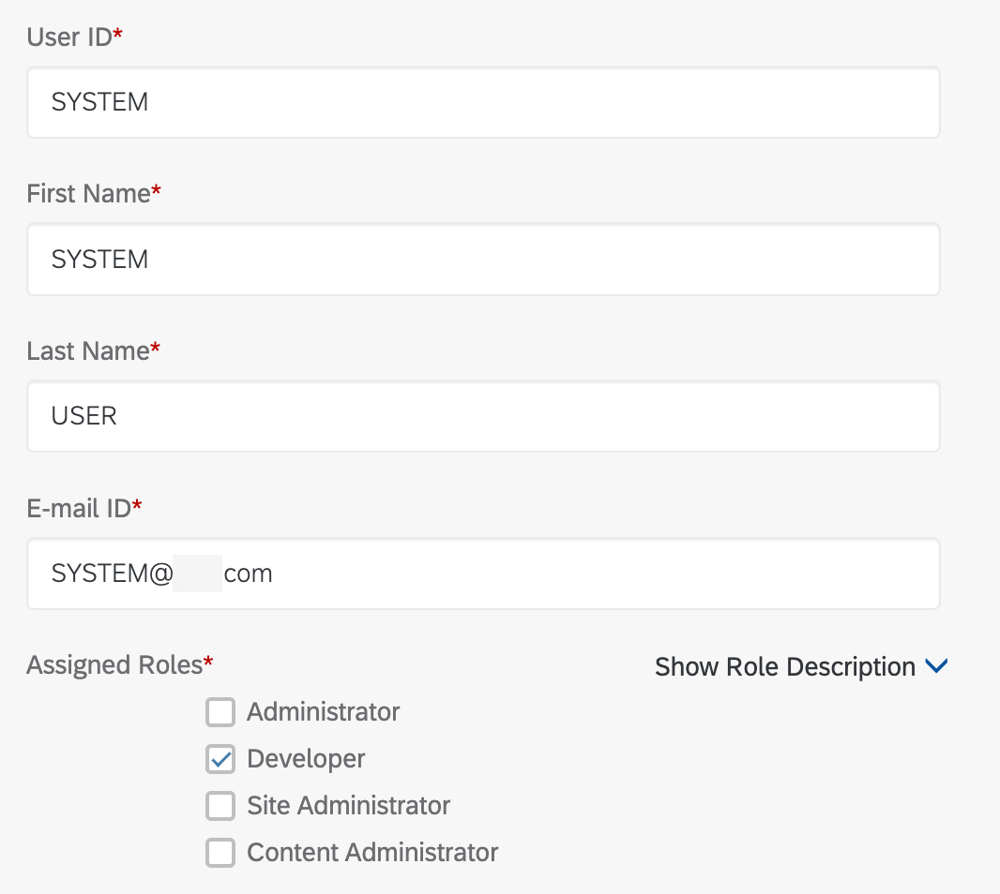

# Image tag rendering test

**1.  Test img tag without '/' in same folder path:**

**2.  Test img tag with '/' relative path**

**3.  Test img tag with './' relative path**

**4.  Test img tag with '../' relative path**

**5.  Test img tag with 'https' absolute path**

**6.  Test img tag enclosed within [] (a href tag) - On clicking image, the image in github should open**

